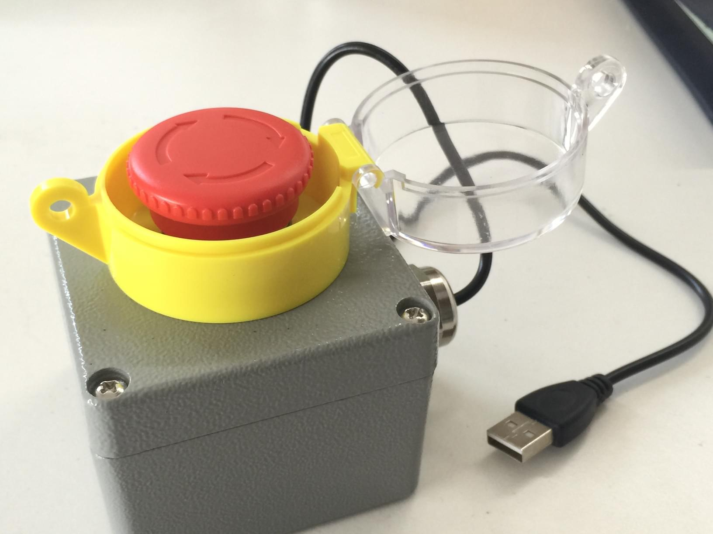
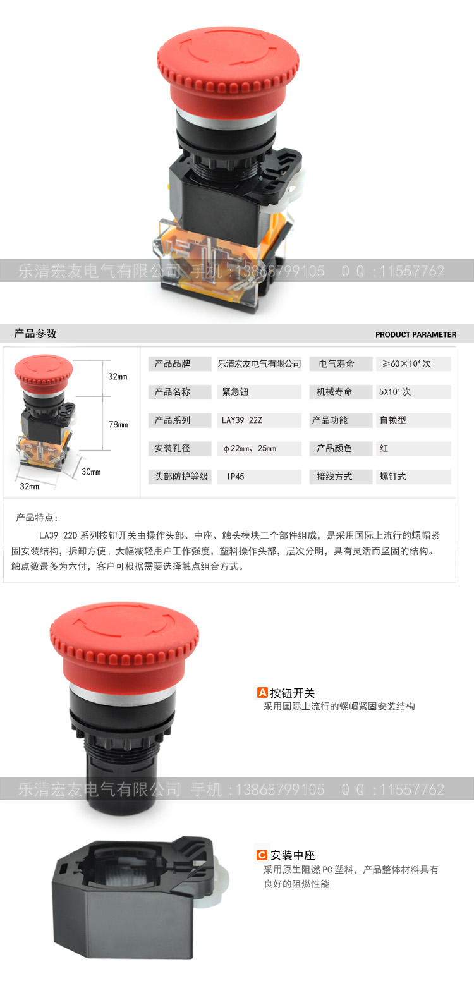
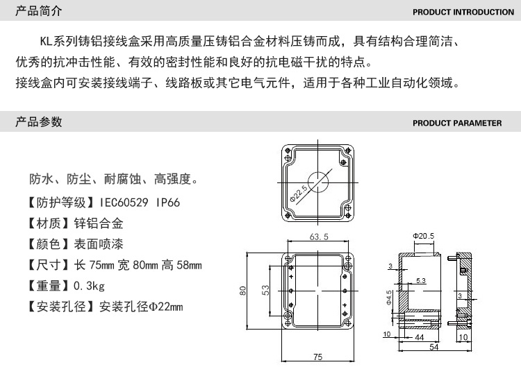
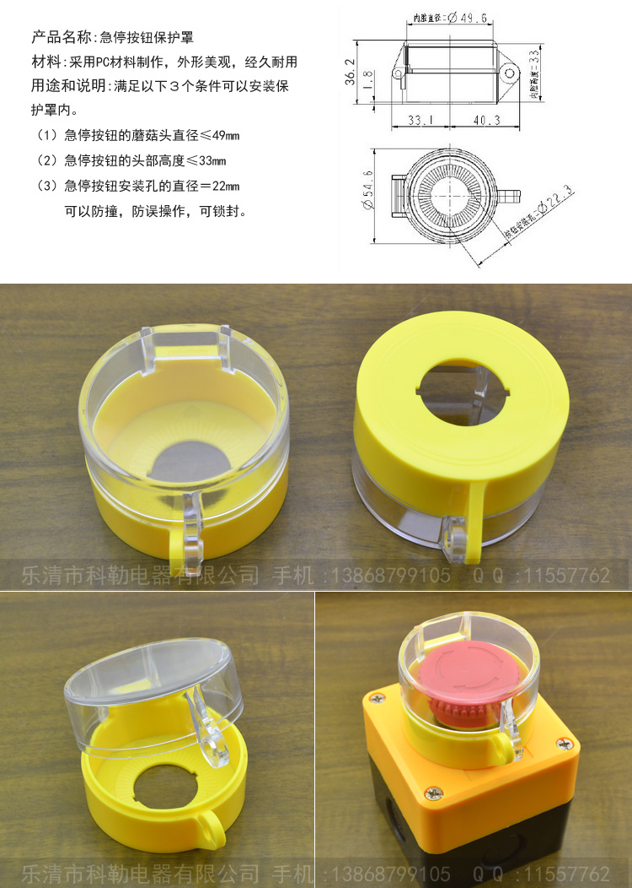
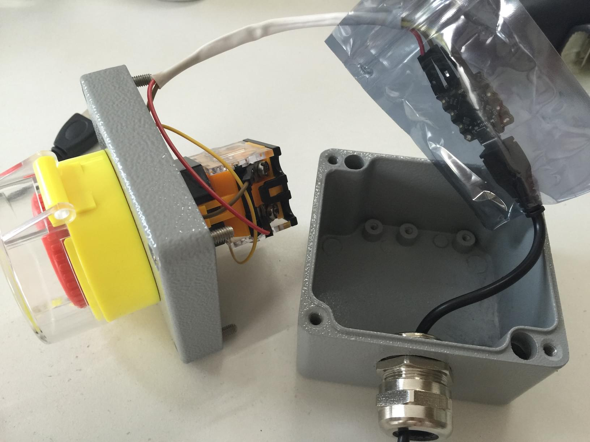
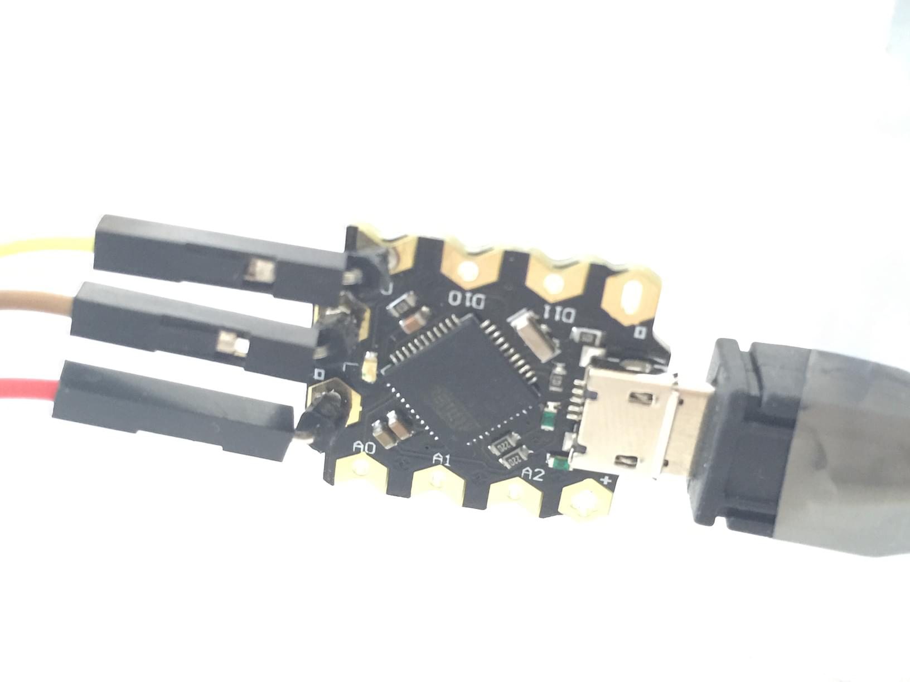

# BigButton
One-button USB HID keyboard

## User Manual
1. Start computer and open a plain text editor *`notepad`on Windows*
2. Press and hold the button, then connect the USB cable
3. Follow the instruction to select a mode
4. Disconnect the cable
5. Connect the cable again with button released
6. Be happy by pressing the button

-

This project is influenced by pictures on WeChat, when I want to buy one from the original creator, it became unavailable. So, I selected parts on taobao and build one by myself.

### License

This project publiced according to WTFPL.

### Hardware

All button & box parts were found from taobao. Total cost (*my version @ 20150521*) RMB98.88.

####The button *LA38-11*

I picked this since I like the arrows on top. It's an auto-lock button, I removed the locker.

####Box

####Yellow Cover

####Arduino Beetle

####Lines

- Micro-USB Cable
- Dupont Line

### Construction

There are many references on [project vim-pedal](https://github.com/foxweb/vim-pedal).

Connect the button

- When its status is released, connect D9 to LOW
- When its status is pressed, connect D9 to HIGH

Then, connect the usb cable

### Program

Currentlly, the program support 6 modes:

- 0. Default mode: Enter.
- 1. Emergency STOP 1: ESC.
- 2. Emergency STOP 2: Ctrl-C.
- 3. Emergency STOP 3: ESC, Enter.
- 4. Emergency STOP 4: ESC, tab, Enter.
- 5. Emergency STOP 5: Ctrl-C, Y, Enter.
- 6. Emergency Shutdown Windows: run "shutdown -s -f -t 0".
- 7. Next Window: Alt-Tab.
- 8. Next App (OSX): Cmd-Tab.
- 9. Next Tab (Byobu): F3.
- 10. BSOD.
	- You need set HKEY_LOCAL_MACHINE\\SYSTEM\\CurrentControlSet\\Services\\kbdhid\\Parameters\\CrashOnCtrlScroll to 1